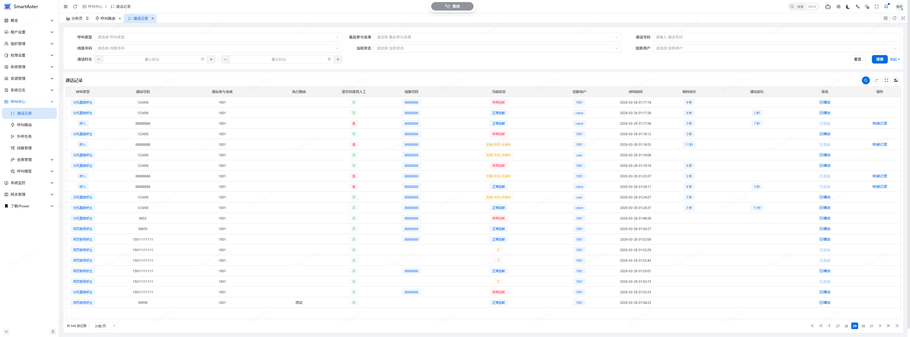
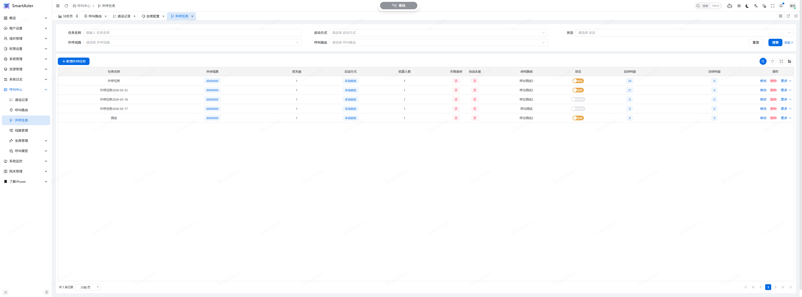

<p align="center">
  
</p>

<h1 align="center">SmartCall · AI-Powered Contact Center</h1>

<p align="center">
  <strong>An AI-driven intelligent customer service call center system — empowering every call with intelligence</strong>
</p>

<p align="center">
  <a href="https://qidiangk.com/" target="_blank">Website</a> |
  <a href="https://smartaster.qidiangk.com" target="_blank">🎯 Live Demo</a> |
  <a href="#-core-capabilities">Core Capabilities</a> |
  <a href="#-system-architecture">Architecture</a> |
  <a href="#️-tech-stack">Tech Stack</a> |
  <a href="#-quick-start">Quick Start</a>
</p>

<p align="center">
  <a href="README.md">中文</a> |
  <a href="README.en.md">English</a>
</p>

<p align="center">
  
  
  
  
  
  
  
  
</p>

---

## 📖 Introduction

**SmartCall** is a next-generation intelligent customer service call center system built on AI large language models and the Asterisk communication engine. The system deeply integrates core capabilities including **AI voice bots**, **intelligent IVR flow orchestration**, **real-time Automatic Speech Recognition (ASR)**, **Text-to-Speech (TTS)**, and **LLM-powered intent recognition**, providing enterprises with a full-chain AI customer service solution from intelligent inbound call handling to smart outbound dialing.

Whether for e-commerce after-sales support, financial debt collection, education enrollment, or enterprise customer service, SmartCall helps businesses significantly reduce labor costs, improve service efficiency, and enhance customer satisfaction through flexible flow orchestration and powerful AI capabilities.


> 🎯 **Live Demo**: [https://smartaster.qidiangk.com](https://smartaster.qidiangk.com)
>
> Username: `demo` ｜ Password: `123456`

> **SmartCall** provides comprehensive deployment and development documentation: [qidiangk.com](https://qidiangk.com/docs/deploy), covering key steps including development environment setup, server startup, frontend execution, microservice deployment, and standalone deployment.

> 💡 This project focuses on the core technical direction of **deep integration between traditional call centers and AI large language models**, centering on key pipelines such as IVR flow orchestration, ASR speech recognition, TTS speech synthesis, LLM intent recognition, and AI agent knowledge base Q&A. It is committed to building natural, fluid intelligent conversational interactions between AI customer service bots and users. The project adopts a clean modular architecture with a solid foundation for extensibility — developers can build upon it to implement secondary development tailored to specific business needs, flexibly extending operational management modules such as agent management, line management, and ticketing systems along with their frontend interfaces. If this project has been helpful to you, please consider giving it a Star — it's our greatest motivation for continuous iteration and improvement ⭐

## ✨ Core Capabilities

### 🤖 AI Intelligent Response

- **LLM Intent Recognition** — Integrates mainstream large language models including Qwen (DashScope) and DeepSeek, achieving precise inbound call intent classification through prompt engineering, with support for custom intent configuration
- **AI Agent Conversation** — Built-in knowledge base agent integration (connected to MaxKB), enabling AI bots to conduct multi-turn intelligent Q&A based on enterprise knowledge bases. Supports automatic conversation context management by caller ID, agent selection, and session management. Architecturally employs a `NodeGranter` plugin design, extensible to integrate with any AI Agent platform such as Dify, Coze, and FastGPT
- **Regex + Model Dual Engine** — Intent determination supports a dual strategy of fast regex matching and deep AI model recognition, balancing response speed with recognition accuracy
- **Sentiment Analysis** — Integrates Alibaba Cloud NLP sentiment analysis to detect customer emotion changes in real time, automatically escalating negative sentiment to human agents
- **AI Information Extraction** — Automatically extracts structured key information such as names, addresses, and order numbers from customer conversations using LLMs, eliminating manual data entry

### 📞 Intelligent IVR Flow Orchestration

- **Visual Flow Designer** — A drag-and-drop IVR flow orchestrator built on LogicFlow, supporting node connections, conditional branching, and sub-flow nesting
- **Rich Flow Nodes**:
    - 🎙️ **Voice Playback (Say)** — Real-time TTS-synthesized voice announcements with SpEL expression support for dynamic content
    - 🎧 **Speech Recognition & Listen (Answer)** — Real-time ASR speech-to-text, capturing customer voice commands with real-time barge-in support
    - 🔢 **DTMF Collection (Received)** — Supports keypad input collection
    - 🧠 **Intent Recognition (Intention)** — LLM-driven multi-intent classification node
    - 🤖 **Agent Conversation (Agent)** — Invokes knowledge base agents for multi-turn Q&A with context memory and dynamic agent selection
    - 🔀 **Conditional Branch (Condition)** — Dynamic conditional routing based on SpEL expressions
    - 📋 **Information Extraction (Extract)** — AI-powered automatic extraction of structured key information from conversations
    - 🔌 **HTTP Service Call (Service)** — Directly invoke external APIs within flows for real-time business data queries
    - 📜 **Script Execution (Script)** — Supports online Groovy / JavaScript script writing and debugging
    - 🔗 **Transfer to Agent (Transfer)** — Intelligent queue distribution with agent group strategy-based routing
    - 📂 **Sub-flow Invocation (Child)** — Modular flow reuse to reduce orchestration complexity
    - 📌 **Variable Assignment (Variable)** — Dynamic global variable management for inter-flow data passing
    - 📴 **Hangup (Hangup)** — Supports playing a closing message before disconnection
    - 📩 **SMS Sending (SMS)** — Sends verification code and notification SMS via SMS template code (`smsCode`), with phone number and template parameters dynamically evaluated by SpEL expressions; executed asynchronously without blocking the flow, ideal for identity verification, business notifications, and post-call SMS follow-up scenarios
- **Online Debugging Tools** — Built-in HTTP API tester and script syntax validator (JavaScript / Groovy Lint) for instant node testing during flow editing

### 🔐 Enterprise-Grade Architecture Foundation

- **Microservice + Standalone Dual Mode** — Built on Spring Cloud, supporting independent microservice deployment or one-click standalone startup, flexibly adapting to scenarios of different scales
- **RBAC Permission System** — Role-based fine-grained access control down to the button level
- **Multi-Tenant Architecture** — Native multi-tenant data isolation, serving multiple enterprises with a single system
- **OAuth2 Unified Authentication** — Centralized identity authentication gateway supporting multiple client types
- **API Gateway** — Unified routing, authentication filtering, CORS handling, access logging, and rate limiting

## 🧩 Extensible Capabilities

This project provides complete data models and extension interfaces at the architecture level for the following operational management features. Developers can perform secondary development based on the existing framework and API layer:

| Module | Extension Foundation | Description |
| --- | --- | --- |
| 📊 Analytics Dashboard | Call data models & statistics VOs | Multi-dimensional analysis including call trends, AI/human ratios, and agent performance |
| 👥 Agent Management | PJSIP queue strategies & SSE status push | Full agent lifecycle management, real-time status monitoring, call hold/transfer |
| 📋 Call Records (CDR) | Call record entities & transfer chain data | Complete call logs, AI call filtering, recording management, failed call statistics |
| 📤 Smart Outbound Dialing | Outbound task entities & distributed scheduling | Batch dialing, intelligent redial, multi-bot concurrency, deduplication |
| 📡 Line Management | Asterisk PJSIP endpoints & registration data | SIP trunk registration, status monitoring, multi-line intelligent routing |

## 🏗️ System Architecture

SmartCall adopts a **microservice + standalone dual-mode architecture**, supporting both independent microservice deployment for high availability and elastic scaling, and one-click standalone startup for rapid deployment — flexibly adapting to enterprise scenarios of different scales.

### Architecture Topology


**Core Call Chains**:

- **Voice Calls**: SIP Phone → Asterisk PBX (SIP Protocol) → AGI triggers IVR flow → smart-aster executes node chain
- **API Requests**: Web Frontend → Nginx → Gateway (Routing / Auth) → Business Services
- **IVR Node Execution**: ASR/TTS Nodes → WebSocket → Voice Services (Qwen DashScope / Alibaba Cloud NLS / China Telecom)
- **Agent Conversation**: Agent Node → smart-maxkb → MaxKB Server (HTTP multi-turn dialogue)

### Module Overview

| Module | Description |
| --- | --- |
| `smart-aster` | **Core Call Module** — Integrates Asterisk AMI/AGI, implementing call control, IVR flow engine, ASR/TTS integration, AI intent recognition, and other core communication capabilities |
| `smart-maxkb` | **AI Agent Module** — Agent platform adaptation layer with built-in MaxKB integration, managing agent application lists, API Key authentication, and multi-turn dialogue session management. Provides knowledge Q&A capabilities for IVR flows. Modular design allows extension to other AI Agent platforms |
| `smart-gateway` | **API Gateway** — Built on Spring Cloud Gateway, providing unified routing, OAuth2 authentication, CORS handling, access logging, and dynamic routing |
| `smart-auth` | **Authentication Center** — Unified identity authentication and authorization service supporting OAuth2 multi-client access |
| `smart-boot` | **Standalone Launcher** — Aggregates all modules for standalone mode, enabling one-click full system startup without microservice infrastructure |
| `smart-api` | **Inter-Service API** — Feign client interface definitions between microservices (including smart-system-api, smart-user-api, smart-resource-api, smart-maxkb-api) |
| `smart-common` | **Common Module** — Shared constants, enums, validation annotations, and utility classes |
| `smart-upms` | **User & Permission Management** — Contains smart-system (system management, dictionaries, organizations, roles, menus, tenants), smart-user (users, positions), smart-resource (files, OSS, SMS) |
| `smart-ops` | **Operations & Monitoring** — Contains smart-log (operation logs, monitoring dashboard), smart-doc (Knife4j API documentation aggregation), smart-admin (Spring Boot Admin service monitoring) |

### Dual-Mode Operation

- **Microservice Mode**: Each module is independently deployed as a Spring Cloud microservice, using Nacos for service registration and configuration management, with Gateway providing unified routing — ideal for large-scale production deployments
- **Standalone Mode**: Simply run the `smart-boot` module to start the complete system without Nacos / Gateway middleware dependencies — ideal for small-to-medium scale rapid deployment and development debugging

## 🛠️ Tech Stack

### Backend Tech Stack

| Technology | Version | Description |
| --- | --- | --- |
| Java | 17 | Runtime environment |
| Spring Boot | 3.5.x | Application framework |
| Spring Cloud | 2025.x | Microservice governance |
| Spring Cloud Alibaba | - | Nacos / Sentinel / Seata |
| Spring AI | - | LLM integration framework (DashScope / DeepSeek) |
| MyBatis-Flex | 1.11.5 | ORM persistence framework |
| Asterisk + PJSIP | - | Open-source PBX communication engine |
| Asterisk-Java | - | Asterisk AMI / AGI Java SDK |
| Alibaba NLS SDK | 2.2.x | Alibaba Cloud intelligent speech (ASR / TTS) |
| DashScope SDK | - | Qwen voice models (Qwen3-ASR / CosyVoice / Qwen-TTS) |
| Spring Cloud Gateway | - | API gateway |
| OpenFeign + OkHttp | - | Inter-service communication |
| Knife4j / SpringDoc | - | API documentation |
| Redisson | - | Distributed locks / caching / messaging |
| Druid | - | Database connection pool & SQL monitoring |
| Retrofit | - | MaxKB HTTP client |
| Groovy / Nashorn | 3.0 / 15.6 | Dynamic scripting engines |
| Undertow | - | High-performance web container |
| Docker / Docker Compose | - | Containerized deployment |
| SkyWalking | 10.4 | Distributed tracing |

### AI & Communication Capabilities

| Capability | Supported | Description |
| --- | --- | --- |
| Large Language Models | Qwen / DeepSeek | Unified abstraction via Spring AI for seamless model switching |
| ASR Speech Recognition | Alibaba Cloud NLS / Qwen DashScope / China Telecom ASR | Real-time streaming speech-to-text with multi-model support and custom integration |
| TTS Speech Synthesis | Alibaba Cloud NLS / Qwen DashScope / China Telecom TTS | Text-to-speech with multi-model, multi-voice, and parameter configuration support |
| Sentiment Analysis | Alibaba Cloud NLP | Real-time sentiment detection (positive / negative / neutral) |
| Knowledge Base Q&A | MaxKB (built-in) / extensible | Enterprise knowledge base agent multi-turn dialogue, extensible to Dify, Coze, FastGPT, and other platforms |

> 💡 **Extensibility**: The system manages voice engines through the `VoiceModelEnum` enumeration, with both ASR and TTS implemented via interface abstractions. Three engines are currently built in — Alibaba Cloud, Qwen (DashScope), and China Telecom — while also supporting custom integration with third-party ASR/TTS engines (such as iFlytek, Baidu Speech, Tencent Cloud, etc.) by simply implementing the corresponding interfaces for seamless replacement.

## 🖥️ Screenshots

> The following screenshots are from the complete product demo environment. The agent management, call records, and outbound task interfaces shown are part of the extensible capabilities that developers can implement through secondary development based on this project.

### Dialpad


### IVR Flow Editor


### Call Records


### Agent Management


### Outbound Tasks


## 🚀 Quick Start

### Prerequisites

| Component | Version Requirement |
| --- | --- |
| JDK | 17+ |
| MySQL | 8.0+ |
| Redis | 6.0+ |
| Asterisk | 22 (PJSIP) |
| Nacos | 3.x (required for microservice mode) |
| MaxKB | v2.6.1 (optional, required for AI knowledge base Q&A) |

### Database Initialization

1. Create databases:

```sql
CREATE DATABASE smartaster DEFAULT CHARACTER SET utf8mb4 COLLATE utf8mb4_general_ci;
CREATE DATABASE smartaster_asterisk DEFAULT CHARACTER SET utf8mb4 COLLATE utf8mb4_general_ci;
```

2. Import SQL scripts:

```
sql/mysql_create_core.sql     -- Core table structures
sql/mysql_smartaster.sql      -- Business data
sql/mysql_asterisk.sql        -- Asterisk configuration tables
```

### Backend Startup

#### Standalone Mode (Recommended for Development)

```bash
# 1. Clone the repository
git clone <repository-url>
cd SmartAster

# 2. Update configuration
# Edit smart-boot/src/main/resources/application.yml
# Modify MySQL, Redis, and other connection settings

# 3. Build the project
mvn clean package -DskipTests

# 4. Start BootStartApplication
java -jar smart-boot/target/smart-boot-exec.jar
```

> Standalone mode requires no Nacos / Gateway — simply access `http://localhost:9999` directly

#### Microservice Mode

```bash
# 1. Start infrastructure
cd script/app
docker-compose up -d nacos

# 2. Configure Nacos
# Import configuration files from docs/config/nacos/ into Nacos

# 3. Start microservices in order
java -jar smart-gateway/target/smart-gateway.jar
java -jar smart-auth/target/smart-auth.jar
java -jar smart-aster/target/smart-aster.jar
java -jar smart-upms/smart-system/target/smart-system.jar
java -jar smart-upms/smart-user/target/smart-user.jar
java -jar smart-upms/smart-resource/target/smart-resource.jar
java -jar smart-ops/smart-log/target/smart-log.jar
java -jar smart-maxkb/target/smart-maxkb.jar
```

### Asterisk Deployment

```bash
# Build the image using the project-provided Dockerfile for one-click Asterisk deployment
cd script/asterisk/image
docker build -t smart/asterisk:22 .

cd script/asterisk
docker-compose up -d
```

> For Asterisk configuration, refer to the config files under `script/asterisk/image/conf/`

### Docker Compose One-Click Deployment


```bash
mvn clean compile jib:dockerBuild
cd script/boot
docker-compose up -d
```

## 📁 Project Structure

```
SmartCall
├── smart-aster              # Core call module (IVR engine / ASR / TTS / AI intent)
├── smart-maxkb              # MaxKB agent integration module
├── smart-gateway            # API gateway (routing / auth / rate limiting / logging)
├── smart-auth               # Unified authentication center
├── smart-boot               # Standalone mode launcher
├── smart-api                # Inter-service Feign APIs
│   ├── smart-system-api
│   ├── smart-user-api
│   ├── smart-resource-api
│   └── smart-maxkb-api
├── smart-common             # Common module (constants / enums / validation annotations)
├── smart-upms               # User & permission management
│   ├── smart-system         #   System management (dictionaries / orgs / roles / menus / tenants)
│   ├── smart-user           #   User management (users / positions / role assignments)
│   └── smart-resource       #   Resource management (files / OSS / SMS)
├── smart-ops                # Operations & monitoring
│   ├── smart-log            #   Logging & monitoring
│   ├── smart-doc            #   Knife4j API documentation aggregation
│   └── smart-admin          #   Spring Boot Admin
├── script                   # Deployment scripts
│   ├── app                  #   Docker Compose orchestration
│   ├── asterisk             #   Asterisk image & configuration
│   ├── docker               #   Nacos / Nginx / SkyWalking / ELK configuration
│   └── elk                  #   ELK logging stack
├── sql                      # Database scripts
└── docs                     # Documentation & configuration templates
```

## 🔌 Extension & Integration

### Custom ASR / TTS Engines

The system manages voice engines through the `VoiceModelEnum` enumeration, allowing per-node ASR/TTS engine selection within IVR flows.

#### Built-in Engines

| Engine | ASR Implementation | TTS Implementation | Description |
| --- | --- | --- | --- |
| Alibaba Cloud | `AliAsrClient` | `AliTtsClient` | Alibaba Cloud NLS intelligent speech, WebSocket streaming |
| Qwen (DashScope) | `DashScopeAsrClient` | `DashScopeTtsClient` | Qwen voice large models with multi-model auto-routing |
| China Telecom | `DianxinAsrClient` | `DianxinTtsClient` | China Telecom AI speech, WebSocket streaming |

#### Qwen (DashScope) Details

The Qwen engine adopts a **proxy + model routing** architecture, automatically selecting the underlying implementation based on the configured model name:

**ASR Speech Recognition** (`DashScopeAsrClient` auto-routing):
- `DashScopeQwenAsrClient` — Qwen3-ASR series (`qwen3-asr-flash-realtime`), based on `OmniRealtimeConversation` API
- `DashScopeFunAsrClient` — Fun-ASR / Paraformer series (`fun-asr-realtime`, `paraformer-realtime-8k-v2`), based on `Recognition` API

**TTS Speech Synthesis** (`DashScopeTtsClient` auto-routing):
- `DashScopeQwenTtsClient` — Qwen3-TTS series (`qwen3-tts-flash-realtime`, `qwen3-tts-instruct-flash-realtime`)
- `DashScopeCosyVoiceTtsClient` — CosyVoice series (`cosyvoice-v3-flash`, `cosyvoice-v3-plus`, etc.)

```yaml
ivr:
  dashscope:
    api-key: ${IVR_DASHSCOPE_API_KEY:}          # DashScope API Key
    # Custom WebSocket URL (configure for on-premise private deployment; leave empty to use Alibaba Cloud official endpoint)
    # websocket-url: wss://your-private-dashscope-server/api-ws/v1/realtime
    asr-option:
      model: qwen3-asr-flash-realtime            # ASR model
      sample-rate: 8000                           # Sample rate (8000 recommended for telephony)
      language: zh                                # Recognition language
    tts-option:
      model: qwen3-tts-flash-realtime            # TTS model
      sample-rate: 8000                           # Sample rate
      volume: 50                                  # Volume [0, 100]
      speech-rate: 1.0                            # Speech rate [0.5, 2.0]
```

> 💡 Each node in an IVR flow can independently configure ASR/TTS engine parameters (model, voice, sample rate, etc.). Dynamic configurations passed from the UI automatically override default values from the configuration file, enabling flexible multi-engine mixing.

### Custom AI Large Language Models

Based on Spring AI's unified abstraction, switch between different LLM providers through configuration:

```yaml
jpower:
  ai:
    primary: dashscope    # Options: dashscope / deepseek / other models (requires importing the corresponding JAR)
spring:
  ai:
    dashscope:
      api-key: your-api-key
      chat:
        options:
          model: qwen3.5-plus
    deepseek:
      api-key: your-api-key
      chat:
        options:
          model: deepseek-r1
```

### AI Agent Platform Integration

The system includes a built-in MaxKB knowledge base platform integration, interacting with agent services through the `AgentChatClient` Feign interface. It supports agent selection, automatic API Key management, and conversation context maintenance by caller ID. The "Agent Conversation" node in IVR flows invokes agent services through the `NodeGranter` plugin mechanism — developers can extend this same mechanism to integrate with other AI Agent platforms:

```yaml
maxkb:
  username: admin
  password: your-password
  baseUrl: http://your-maxkb-host:8081/
  externalBaseUrl: http://your-maxkb-host:8081/   # External access URL
```

### On-Premise Deployment

The system **fully supports on-premise (private) environment deployment** — all external dependencies can be configured to point to internal network addresses:

- **Voice Engines**: Qwen DashScope supports custom `websocket-url`, allowing ASR/TTS WebSocket connections to point to privately deployed on-premise voice services without public internet access
- **AI Large Language Models**: DeepSeek / Qwen and other models are configured via `base-url`, supporting on-premise LLM inference services (such as vLLM, Ollama, etc.)
- **Agent Platforms**: MaxKB's `baseUrl` configuration directly supports internal network addresses
- **Infrastructure**: MySQL, Redis, Nacos, Asterisk, and all other components inject connection information via environment variables, adapting to any on-premise environment
- **Containerized Deployment**: Complete Docker Compose orchestration files are provided for one-click deployment of all services

## 📄 License

SmartCall open-source software is licensed under the [Apache 2.0 License](https://www.apache.org/licenses/LICENSE-2.0.html), permitting commercial use, but attribution and copyright information must be retained.

## 🌱 Contributing

SmartCall's growth depends on every contribution from the community. Whether it's submitting a bug fix, sharing a feature idea, improving documentation, or proposing an optimization — every effort meaningfully advances the project.

- 🐛 **Report Issues**: Encountered a problem? Feel free to report it via [Issues](../../issues) — please include reproduction steps and environment details when possible
- 💡 **Feature Suggestions**: Have a great idea or improvement? Start a discussion via Issues and let's evaluate feasibility together
- 🔧 **Submit Code**: Fork the project → Create a branch → Submit a Pull Request — please ensure your code style is consistent with existing conventions
- 📖 **Improve Documentation**: Clear and comprehensive documentation is essential for every new user — contributions and corrections are welcome

We look forward to making SmartCall better, together.

## 🤝 Contact Us

- **Website**: [https://qidiangk.com](https://qidiangk.com)
- **Email**: ding931226@yeah.net
- **Enterprise Services**: For a ready-to-use complete call center solution and technical support, please visit our website for more information

---

<p align="center">
  <strong>SmartCall — Empowering Every Call with AI</strong>
</p>
